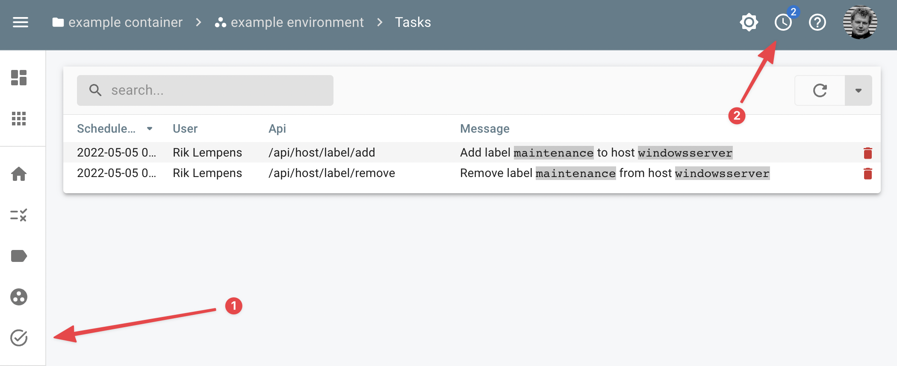

# ::material-check-circle-outline: Tasks

You can view the status of the scheduled tasks by visiting the tasks menu :material-check-circle-outline: or lookup your scheduled tasks via the :material-clock-outline: button near your avatar.

<figure markdown>
  
  <figcaption>Task status</figcaption>
</figure>