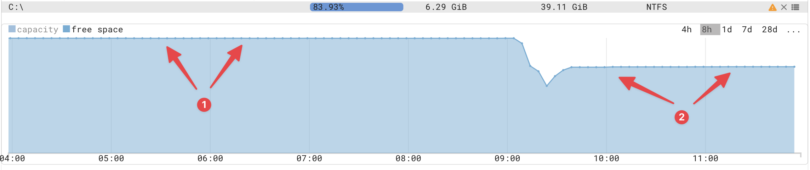
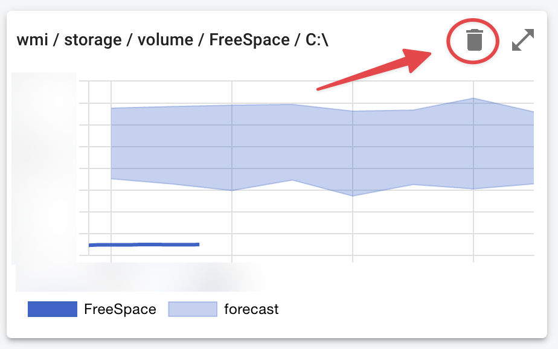

{ width="150" align=right}

# Forecasting

Forecasting is automatically enabled for metrics when used in conditions.

## Forecast maintenance

In some scenarios a forecast needs to be reset.

A good example is show below where free space drops and the settles.

{ width="800"}

You can force generating a new forecast by deleting the previous forecast as shown below:

{ width="600"}

