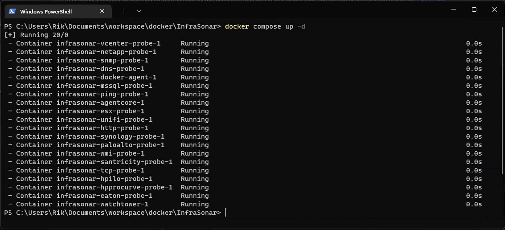

{ width="150" align=right}

# InfraSonar on Windows

As InfraSonar uses Docker containers it can be easily deployed on multiple platforms including Microsoft Windows.

Docker is a great concept to deploy and maintain Linux applications and services even on a Microsoft Windows host.

Checkout the [Get Started with Docker](https://www.docker.com/get-started/) guide to learn more.


There are two options to accomplish this:

1. Docker Desktop for Windows (ideal for home-lab and test-scenarios)<br>
   _The official Docker documentation has a great [guide]((https://docs.docker.com/desktop/install/windows-install/)) on this_
2. Use containers with Hyper-V isolation on Windows.<br>
   _We found the [Ubuntu documentation](https://ubuntu.com/tutorials/windows-ubuntu-hyperv-containers#1-overview) to be most useful._


!!! info
    We tested this setup on a Windows 11 host running Docker Desktop version 4.17.0

## Deploy the InfraSonar containers

Step by step :feet: guide: 

1. Open notepad :notepad_spiral:
2. Copy the [docker-compose.yml](../collectors/probes/appliance/docker_compose.md) file from our documentation page using the :material-content-copy: button
3. Paste the file into the just opened notepad
4. Ensure to set the correct [tokens](../application/tokens.md) for the agentcore and docker-probe in the `docker-compose.yml` file
5. Save the file as `docker-compose.yml`, in this example we use a folder named `InfraSonar` in de `Documents` folder.<br>
   !!! Be aware notepad has a tendency of adding `.txt` at the end of the filename.
6. Open a dos box `cmd.exe`
7. `cd` to the folder containing the `infrasonar.yml` file<br>
   ```
   cd %userprofile%\documents\infrasonar
   ```
8. Pull the InfraSonar containers using this compose pull:<br>
   ```
   docker compose pull
   ```
   _Downloading all layers might take some time, the total size off all layers is 5Gb_
9. Once the containers are downloaded you can start the environment using:<br>
   ```
   docker compose up -d
   ```

<figure markdown>
  { width="800" }
  <figcaption>InfraSonar on Windows</figcaption>
</figure>


## Tune Vmmem memory consumption

As shown by this `docker stats` output resource usage for the InfraSonar probes is very limited.
WSL however claims a lot of memory by default.


```console title="docker stats output"
CONTAINER ID   NAME                            CPU %     MEM USAGE / LIMIT     MEM %     NET I/O   BLOCK I/O   PIDS
bbf5f976f370   infrasonar-eaton-probe-1        0.01%     6.105MiB / 1.865GiB   0.32%     0B / 0B   0B / 0B     1
8c9e76c02422   infrasonar-ping-probe-1         0.04%     8.492MiB / 1.865GiB   0.44%     0B / 0B   0B / 0B     1
17e811490457   infrasonar-vcenter-probe-1      0.01%     7.301MiB / 1.865GiB   0.38%     0B / 0B   0B / 0B     1
cd31bd13a236   infrasonar-agentcore-1          0.01%     6.812MiB / 1.865GiB   0.36%     0B / 0B   0B / 0B     2
69f1e6ccc784   infrasonar-mssql-probe-1        0.01%     6.719MiB / 1.865GiB   0.35%     0B / 0B   0B / 0B     1
e33dee93aaaa   infrasonar-tcp-probe-1          0.01%     5.312MiB / 1.865GiB   0.28%     0B / 0B   0B / 0B     1
276f90782d43   infrasonar-santricity-probe-1   0.01%     8.035MiB / 1.865GiB   0.42%     0B / 0B   0B / 0B     1
72b609c9aa8f   infrasonar-paloalto-probe-1     0.01%     7MiB / 1.865GiB       0.37%     0B / 0B   0B / 0B     1
ae075f468016   infrasonar-docker-agent-1       0.03%     59.76MiB / 1.865GiB   3.13%     0B / 0B   0B / 0B     2
886cc62a929e   infrasonar-netapp-probe-1       0.01%     6.957MiB / 1.865GiB   0.36%     0B / 0B   0B / 0B     1
d75b00d7f3ea   infrasonar-esx-probe-1          0.01%     6.383MiB / 1.865GiB   0.33%     0B / 0B   0B / 0B     1
b44ff0ac2e3a   infrasonar-wmi-probe-1          0.02%     6.992MiB / 1.865GiB   0.37%     0B / 0B   0B / 0B     1
3d1e2202050c   infrasonar-hpprocurve-probe-1   0.01%     6.938MiB / 1.865GiB   0.36%     0B / 0B   0B / 0B     1
be51bb8784ba   infrasonar-unifi-probe-1        0.01%     6.695MiB / 1.865GiB   0.35%     0B / 0B   0B / 0B     1
696339a2d744   infrasonar-snmp-probe-1         0.01%     10.4MiB / 1.865GiB    0.54%     0B / 0B   0B / 0B     1
1fa404f5d74d   infrasonar-dns-probe-1          0.01%     5.66MiB / 1.865GiB    0.30%     0B / 0B   0B / 0B     1
525d977d3fe0   infrasonar-hpilo-probe-1        0.01%     6.898MiB / 1.865GiB   0.36%     0B / 0B   0B / 0B     1
c33ffae3eaeb   infrasonar-synology-probe-1     0.01%     6.531MiB / 1.865GiB   0.34%     0B / 0B   0B / 0B     1
8b6b0ceb9038   infrasonar-http-probe-1         0.01%     6.902MiB / 1.865GiB   0.36%     0B / 0B   0B / 0B     1
```

Luckily there is an easy fix.

**Shut down WSL**

Run this on your command line:
```
wsl --shutdown
```

**Edit your .wslconfig file**

As the .wslconfig file is a hidden file it is best to open it directly using notepad:
```
notepad %UserProfile%/.wslconfig
```

If it doesn’t exist yet, just create it.

Edit your `.wslconfig` file to limit memory usage
You should have something like this in the file:

```
[wsl2]
memory=2GB
```