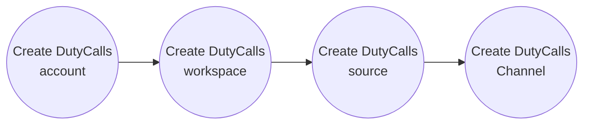
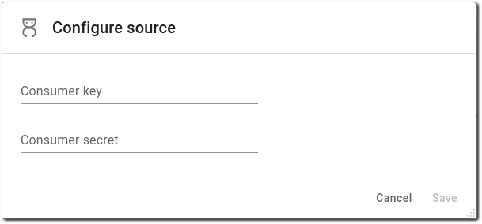
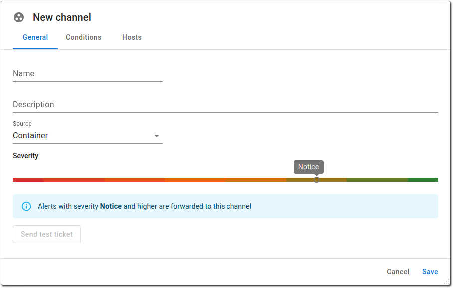

# DutyCalls

Do you want to stay informed about the latest InfraSonar alerts directly in DutyCalls? Make use of the ready-made [DutyCalls](https://dutycalls.me/) integration.

This guide helps you to to get started with DutyCalls.

## DutyCalls configuration

Implementing DutyCalls is a four step approach.

### Create a DutyCalls account

Creating a DutyCalls account is the first step. The [DutyCalls sign-up documentation](https://dutycalls.me/#/authentication/sign-up) provides additional information on account creation.

### Create a DutyCalls workspace

A [DutyCalls workspace](https://docs.dutycalls.me/getting-started/create-workspace/) is usually a representation of a company or department.

Steps for creating a workspace:

1. Enter the workspace name
2. Set the correct timezone
3. Provide an optional icon for your workspace (_Only icons of the PNG format are accepted and the maximum dimensions are 128 x 128 pixels. The width and height must also be equal to each other._)

### Create a DutyCalls source

For InfraSonar we use DutyCalls custom API mapping to format the data toward a compatible [DutyCalls data source]((https://docs.dutycalls.me/getting-started/#step-2-add-a-source))

InfraSonar specific steps:

1. Open the previously created workspace
2. Select **Services** from the right hand menu
3. Click the **Add service** button
4. Provide a name for the service e.g. *InfraSonar* and click **next**
5. Select **yes** when asked if you want to use a predefined template and **select** the *InfraSonar* template
6. Click **Add** to continue

### Create a DutyCalls channel

A DutyCalls [channel](https://docs.dutycalls.me/getting-started/#step-3-add-a-channel) must be linked to the source created in the previous step.

1. Browse to the previously created service
2. Click the **Add channel** button
3. Provide a **name** for your channel, we suggest to keep the channel name and environment name the same. Setting up a channel per environment is our best practice.
4. Choose the **manager** for this channel, the manager get's notified if something is amiss within the channel
5. Select the previously created **InfraSonar service**
6. Set the minimum number of active subscribed to your organizations needs, when this is your first setup you might want to set this to **1**
7. Click **Add**
8. Observe the channel and note the *No. Active Subscribers* is `0/1`, click **subscribe** to retrieve notifications for this channel

DutyCalls has now been setup, next step is to configure InfraSonar to integrate with DutyCalls.

## InfraSonar configuration

To complete the setup and receive alerts in DutyCalls, some additional configuration has to be done in InfraSonar.

This step requires the DutyCalls Service credentials.

### Retrieve DutyCalls Service credentials

1. Open [DutyCalls](https://dutycalls.me/)
2. Select **Services** from the left hand menu
3. Click the **Setup** icon from the service you have setup for InfraSonar
4. Click **Send security code**; *this wil send a code to the email address you are logged on with in DutyCalls.*
5. Enter the received security code
6. Make note od the **username** and **password**

### Source configuration

The first step is to add the source you just created to the desired InfraSonar container.

1. Select the container for which you would like to configure DutyCalls.
2. Click the _DutyCalls_ icon in the left hand menu, this should open the DutyCalls configuration page
3. Click on the **Configure source** button.
4. Enter the previously retrieved username as **Consumer key** and the password as **Consumer secret** and click on the **Save** button.
   {: style="width:500px"}

### Channel configuration

The second step is to add the channel you created to the container you selected in the previous step.

1. Select the **Channels** option from the left-hand menu in InfraSonar
2. Click the **Add channel** button to add a DutyCalls channel
3. Provide the correct **Channel name** as previously created in DutyCalls
4. Enter an optional description
5. Select the correct **DutyCalls source**
6. Optionally set `condition` and `host` filters, to filter the alerts that will be forwarded to DutyCalls.

    {: style="width:500px"}

The configuration has now been completed. Alerts related to the configured InfraSonar container will be posted in the configured DutyCalls channel.