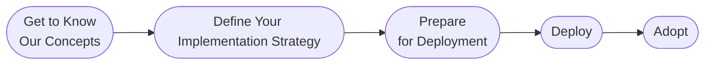
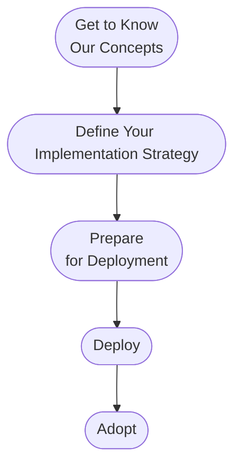

{ width="150" align=right}

# Getting started with InfraSonar

> Feel free to book a free [implementation consultancy](../support/consultancy.md) session to get you up and running quickly.

Begin your InfraSonar journey with our proven, actionable approach, designed to ensure a smooth and efficient implementation process.

## Get to Know Our Concepts

* **Deep Dive into Documentation:** Thoroughly review the InfraSonar documentation to understand its architecture, features, and capabilities.
* **Conceptual Understanding:** Grasp the core concepts, such as [assets](../concept/assets.md), [collectors](../concept/collectors.md), [labels](../application/labels.md), [conditions](../concept/conditions.md), [alerts, and notifications](../concept/alerts-notifications.md).
* **Hands-on Exploration (Sandbox/Demo):** setup sandbox environment or [ask us](../support/index.md) for a demo to familiarize yourself with the platform's interface and functionality.
* **Attend Training/Webinars:** Participate in our [training sessions](../support/training.md) to gain deeper insights and ask questions.

## Define Your Implementation Strategy

* **Identify Monitoring Goals:** Clearly define your monitoring objectives and the key performance indicators (KPIs) you want to track.
* **Inventory Your Assets:** Create a comprehensive inventory of all assets (IT, OT, etc.) that need to be monitored, consider using our [discover collector](../collectors/agents/discovery.md) to assist you in this task.
* **Determine Monitoring Scope:** Define the scope of your monitoring, decide which collectors you want to deploy.
* **Develop a Labeling Strategy:** Plan your labeling strategy to effectively organize and categorize your assets.
* **Define Condition Requirements:** Elevate our pre-defined conditions and determine if these are sufficient for your organizations needs.
* **Create Authorization and User Roles:** Plan what user roles you need, and what views they should have access to.
* **Develop a Rollout Plan:** Define a timeline and phased approach for deploying InfraSonar.

## Prepare for Deployment

 * **Infrastructure Assessment:** Assess your existing infrastructure to ensure compatibility with InfraSonar.
 * **Network Configuration:** Configure network settings and firewall rules to allow InfraSonar to communicate with your assets.
 * **Collector Deployment Planning:** Plan where collectors will be deployed, and how they will be installed.
 * **Credential Management:** Setup credentials for accessing monitored assets and define a process for changing the any passwords according to your organizations requirements.. 
 * **Test Environment Setup:** Create a test environment to validate your configuration and deployment process.
 * **Document Procedures:** Create custom documentation for the deployment and configuration process for your organization.

## Deploy

* **Install InfraSonar Appliance (if applicable):** Deploy the [InfraSonar appliance](../collectors/probes/appliance/index.md) if applicable for your chosen deployment model.
* **Deploy Collectors:** Install and configure collectors for or on your assets. ([probes](../collectors/probes/index.md), [agents]((../collectors/agents/index.md)) and/or [services](../collectors/services/index.md))
* **Configure Assets and Labels:** Add your [assets](../application/assets.md) to InfraSonar and apply the necessary [labels](../application/labels.md).
* **Define Conditions and Alerts:** Configure the conditions and alerts based on your monitoring requirements.
* **Validate Data Collection:** Verify that InfraSonar is successfully collecting data from your assets, ensure there are **no** notifications.
* **Test Alerting:** Test the alerting functionality to ensure that notifications are being sent correctly.
* **Create Views:** Create custom views to visualize your monitoring data.

## Adopt

* **Train Your Team:** Provide training to your team on how to use InfraSonar and interpret monitoring data.
* **Integrate with Existing Systems:** Integrate InfraSonar with your existing incident management and ticketing systems.
* **Establish Monitoring Procedures:** Define clear procedures for responding to alerts and resolving issues.
* **Regularly Review and Optimize:** Continuously review your monitoring configuration and optimize it as needed.
* **Gather Feedback:** Collect feedback from your team and users to identify areas for improvement.
* **Stay Up-to-Date:** Keep up with the latest InfraSonar updates and features.
* **Create Knowledge Base:** Create a knowledge base with common issues and their solutions.

## ======
Actionable roadmap:

**InfraSonar Implementation Steps: A Comprehensive Guide**

1.  **Get to Know Our Concepts:**
    * **Deep Dive into Documentation:** Thoroughly review the InfraSonar documentation to understand its architecture, features, and capabilities.
    * **Conceptual Understanding:** Grasp the core concepts, such as [assets](../concept/assets.md), [collectors](../concept/collectors.md), [labels](../application/labels.md), [conditions](../concept/conditions.md), [alerts, and notifications](../concept/alerts-notifications.md).
    * **Hands-on Exploration (Sandbox/Demo):** setup sandbox environment or [ask us](../support/index.md) for a demo to familiarize yourself with the platform's interface and functionality.
    * **Attend Training/Webinars:** Participate in our [training sessions](../support/training.md) to gain deeper insights and ask questions.

2.  **Define Your Implementation Strategy:**
    * **Identify Monitoring Goals:** Clearly define your monitoring objectives and the key performance indicators (KPIs) you want to track.
    * **Inventory Your Assets:** Create a comprehensive inventory of all assets (IT, OT, etc.) that need to be monitored, consider using our [discover collector](../collectors/agents/discovery.md) to assist you in this task.
    * **Determine Monitoring Scope:** Define the scope of your monitoring, decide which collectors you want to deploy.
    * **Develop a Labeling Strategy:** Plan your labeling strategy to effectively organize and categorize your assets.
    * **Define Condition Requirements:** Elevate our pre-defined conditions and determine if these are sufficient for your organizations needs.
    * **Create Authorization and User Roles:** Plan what user roles you need, and what views they should have access to.
    * **Develop a Rollout Plan:** Define a timeline and phased approach for deploying InfraSonar.

3.  **Prepare for Deployment:**
    * **Infrastructure Assessment:** Assess your existing infrastructure to ensure compatibility with InfraSonar.
    * **Network Configuration:** Configure network settings and firewall rules to allow InfraSonar to communicate with your assets.
    * **Collector Deployment Planning:** Plan where collectors will be deployed, and how they will be installed.
    * **Credential Management:** Setup credentials for accessing monitored assets and define a process for changing the any passwords according to your organizations requirements.. 
    * **Test Environment Setup:** Create a test environment to validate your configuration and deployment process.
    * **Document Procedures:** Create custom documentation for the deployment and configuration process for your organization.

4.  **Deploy:**
    * **Install InfraSonar Appliance (if applicable):** Deploy the [InfraSonar appliance](../collectors/probes/appliance/index.md) if applicable for your chosen deployment model.
    * **Deploy Collectors:** Install and configure collectors for or on your assets. ([probes](../collectors/probes/index.md), [agents]((../collectors/agents/index.md)) and/or [services](../collectors/services/index.md))
    * **Configure Assets and Labels:** Add your [assets](../application/assets.md) to InfraSonar and apply the necessary [labels](../application/labels.md).
    * **Define Conditions and Alerts:** Configure the conditions and alerts based on your monitoring requirements.
    * **Validate Data Collection:** Verify that InfraSonar is successfully collecting data from your assets, ensure there are **no** notifications.
    * **Test Alerting:** Test the alerting functionality to ensure that notifications are being sent correctly.
    * **Create Views:** Create custom views to visualize your monitoring data.

5.  **Adopt:**
    * **Train Your Team:** Provide training to your team on how to use InfraSonar and interpret monitoring data.
    * **Integrate with Existing Systems:** Integrate InfraSonar with your existing incident management and ticketing systems.
    * **Establish Monitoring Procedures:** Define clear procedures for responding to alerts and resolving issues.
    * **Regularly Review and Optimize:** Continuously review your monitoring configuration and optimize it as needed.
    * **Gather Feedback:** Collect feedback from your team and users to identify areas for improvement.
    * **Stay Up-to-Date:** Keep up with the latest InfraSonar updates and features.
    * **Create Knowledge Base:** Create a knowledge base with common issues and their solutions.