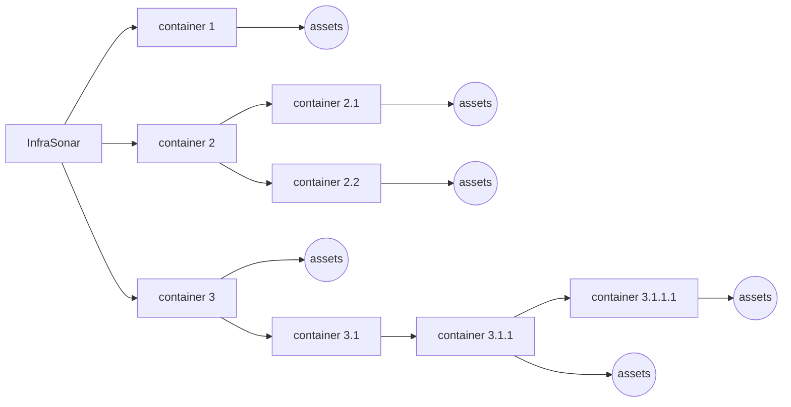

{ width="150" align=right}

# Getting started with InfraSonar

There are a couple of things to consider when starting with InfraSonar.

> This why we offer free implementation consultancy to get you up and running.

## Implementation considerations

1. Container layout
2. Implementation strategy
3. Deployment strategy

## Organization

Containers represent a logical grouping of monitored infrastructure components in the InfraSonar platform

Here's how InfraSonar uses containers:

* **Grouping and managing assets**: Containers seem to act as organizational units for assets, collectors, and alerts.
* **Querying and filtering**: InfraSonar allows users to query containers and their associated data, such as IDs, alerts, assets, and collectors
* **Configuration**: 
    * Containers have configurable properties like mode, properties, zones, external notification rules etc.
    * [Authorizations](../application/users.md), [labels](../application/labels.md) and [conditions](../application/conditions.md) propagate form their parents to their children.

!!! tip "Usefull feature for managed service providers"
    Containers are a useful feature for managed service providers as it allows them to create a container per customers.
    If you feel our container concept might fit your needs we suggest to use your top level container as an organization placeholder and not to add assets here.
    Containers can easily be use to reflect any organization as we allow for an elaborate container hierarchy.

The picture below outlines our container concept:

Don't overthink this step, InfraSonar makes it easy to move containers and assets. Labels and conditions can also be moved but only to an "upstream" parent. 

## Collector scenarios

Next step is to consider how to deploy your collectors to retrieve monitoring data.
InfraSonar supports three types of collectors used to retrieve monitoring data.

### Agents

Agents are deployed on an asset an run autonomously, monitoring data is typically send directly to the InfraSonar platform.

### Probes

Probes collect data agentless, data is collected using monitoring protocols or API’s supplied by the vendor.

An example of a probe is our WMI probe to monitor Microsoft Windows assets.

Probes are typically deployed on a Linux appliance using Docker. Probe are orchestrated by our [agentcore](../collectors/probes/agentcore.md), the agentcore is also responsible for sending the data to our cloud platform. See our [probes documentation](../collectors/probes/index.md) for additional probe related documentation and an overview currently supported probes.

### Services

Services are kind of similar to probes as they retrieve data agentless. The main difference though is that the run on the InfraSonar cloud platform. Examples of InfraSonar services include our Microsoft Azure, Microsoft 365 and mail roundtrip.
    
See our [services documentation](../collectors/services/index.md) for additional services related documentation and an overview currently supported services.

## Picking a collector strategy

Our collectors can be combined on assets.

You can for example use our Microsoft Azure service to provide information from a cloud provider perspective while using our Microsoft Windows agent to monitoring the Microsoft Windows internals and our DNS probe to monitor internal DNS records.

When you are monitoring an on-premise infrastructure we suggest deploying our appliance first and start with an agent-less implementation.
