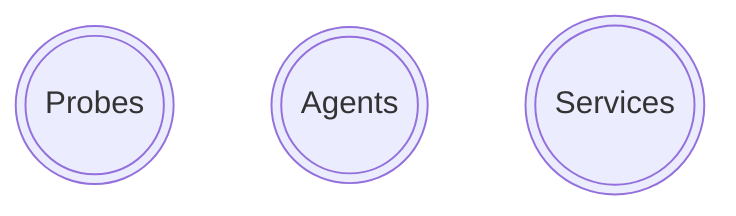
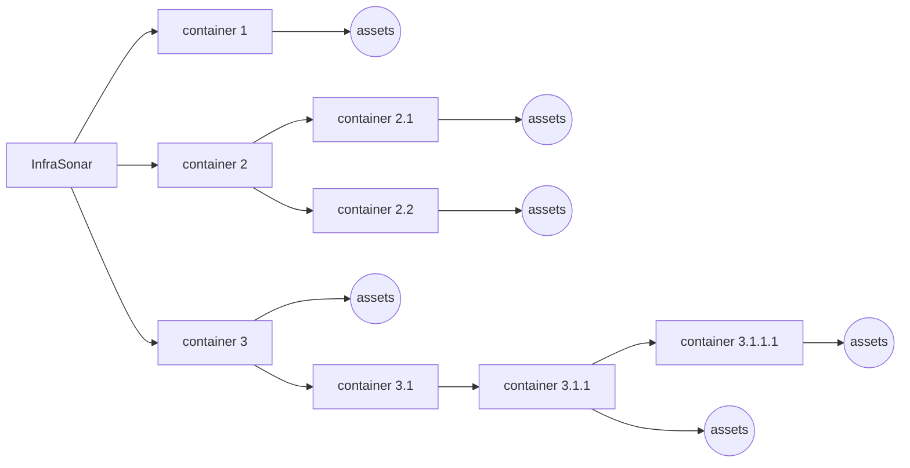

{ width="150" align=right}

# Getting started with InfraSonar

InfraSonar is an in depth infrastructure monitoring solution developed and maintained by [Cesbit](https://cesbit.com), a software development company with years of experience in IT infrastructure monitoring and handling large volumes of data.

## Concept overview

### Data collection

InfraSonar identifies three concepts for retrieving monitoring data as outlined below.

**Probes**
:   Probes collect data agentless, data is collected using monitoring protocols or API’s supplied by the vendor. An example of a probe is our WMI probe to monitor Microsoft Windows assets. Probes are typically deployed on a Linux appliance using Docker.
    
    Probe are orchestrated by our [agentcore](../collectors/probes/agentcore.md), the agentcore is also responsible for sending the data to our cloud platform.
    
    See our [probes documentation](../collectors/probes/index.md) for additional probe related documentation and an overview currently supported probes.

**Agents**
:   Agents run autonomously on an endpoint and send data straight to the InfraSonar platform.

    See our [agent documentation](../collectors/agents/index.md) for additional agent related documentation and an overview currently supported agents.

**Services**
:   Services are like probes as they retrieve data agentless but run on the InfraSonar cloud platform. Examples of InfraSonar services include our Microsoft Azure, Microsoft 365 and mail roundtrip.
    
    See our [services documentation](../collectors/services/index.md) for additional services related documentation and an overview currently supported services.

### Data analysis

Probes, services and agents send their collected data to the InfraSonar backend, a fully managed cloud solutions where the last known state is stored, data is evaluated using conditions and performance metrics are stored for future analysis.

#### Containers

InfraSonar is a multi-tenant solution by design and uses a concept of [containers](../application/containers.md) to group hosts.
Grouping occurs automatically as the data can only be send to the platform when it is accompanied by a token, these tokens are issues on container level.

The picture below outlines our container concept:

[Authorizations](../application/users.md), [labels](../application/labels.md) and [conditions](../application/conditions.md) propagate form their parents to their children.

#### Conditions

When data arrives it is evaluated using [conditions](../application/conditions.md), these conditions are added to an asset by applying [labels](../application/labels.md).

Conditions can use the previous state to detect unwanted changes. Conditions on metrics for which [time-series](../application/timeseries.md) are available can also use our prediction routine to detect anomalies.

[Rules](../application/rules.md) can be used to setup notifications or webhook integrations.

## Implementation

As with any project good preparation is the key to success.

!!! tip Read the pre-requisites

    We urge you to read the pre-requisites for each collector you want to deploy.

### Implementation tips and tricks :material-magic-staff:

#### Credentials and IP authorization

Most probes require credentials to query remote assets, were possible we suggest to use read-only accounts. Refer to the specific probe documentation to learn how to configure accounts.

Some assets such as the [SNMP collector](../collectors/probes/snmp/index.md) requite the IP address from which the asset is queried to be whitelisted.

#### Guest lists

Some collectors allow guests to be easily added from a guest list retrieved by the collector.

Collectors that support this feature include:

* [Microsoft hyperV](../collectors//probes/wmi/hyperv.md)
* [Unifi collector](../collectors/probes/unificontroller.md)
* [VMware ESXi](../collectors/probes/vmware/esx.md)
* [VMware vCenter](../collectors/probes/vmware/vcenter.md)

#### Toolkit

The [InfraSonar tool](https://github.com/infrasonar/toolkit) can be used to manage assets for a container. The tool has two main features. One is to read all assets from a container to YAML output. If needed, all collector and label information can be included. The other feature of this tool is to apply a YAML file to InfraSonar. These two features combined allow you to easily add new assets as well as managing existing assets for a container.

### Network considerations

* Data from probes is send to the InfraSonar cloud platform via an agentcore, see the agentcore documentation for it's TCP port usage [here](../collectors/probes/agentcore.md)
* The IP addresses used by InfraSonar services might need to be whitelisted to allow data retrieval, the list of IP addresses used by services can be found [here](../collectors/services/index.md)
* Agents send data to the InfraSonar API using HTTPS

## Implementation support

Feel free to [reach out to us](support.md) for support when implementing/evaluating InfraSonar.

Our implementation Consultants are keen to show you around and get the best out of our platform.