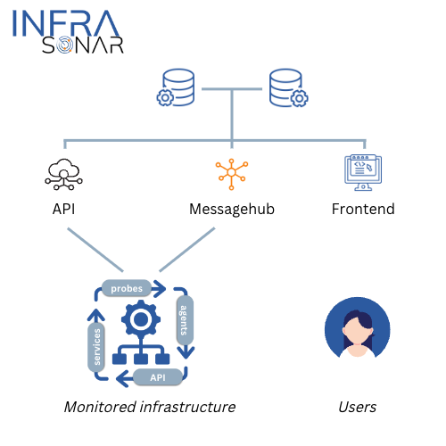

# Platform

This section provides an overview of the InfraSonar monitoring platform.

## Architectural overview

An architectural overview of the InfraSonar platform

{ width="500"}

InfraSonar can be broken down in three area's:

1. Collectors;
2. InfraSonar cloud;
3. InfraSonar application.

## Collectors

Within InfraSonar, we identify three concepts for collecting data:

* **[Agents](../collectors/agents/index.md)** 
  Agents run autonomously on an endpoint and send data straight to the InfraSonar platform.
* **[Probes](../collectors/probes/index.md)** 
  Probes query an endpoint using a specific protocol.
* **[Services](../collectors/services/index.md)** 
  Services monitor an endpoint and report the status to multiple containers. 
  *E.g. [Microsoft 365 Service Health Status](https://status.office365.com/)*

## InfraSonar cloud

The InfraSonar cloud platform is hosted on the [Google Cloud Platform](https://cloud.google.com/).

Data from a monitored environment is received and processed in the InfraSonar cloud platform on what we call the Hubs. These Hubs evaluate the data against configured conditions and store received time series data in [SiriDB](https://siridb.net/). Received state data is kept in memory by the Hubs.

## InfraSonar application

The InfraSonar application is a web based user interface which accessible using any modern web browser.

The application can send messages to end-users using email or Dutycalls.

See our [application section](../application/index.md) in the documentation for more information
