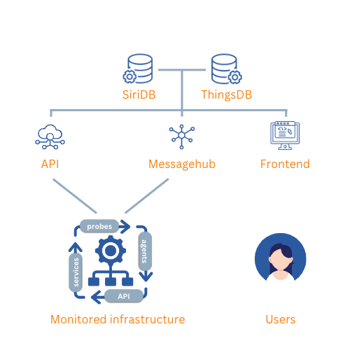

# Platform

{ width="150" align=right}

The InfraSonar cloud platform is hosted on the [Google Cloud Platform](https://cloud.google.com/).

Data from a monitored environment is received and processed in the InfraSonar cloud platform on what we call the Hubs. These Hubs evaluate the data against configured conditions and store received time series data in [SiriDB](https://siridb.net/). Received state data is kept in memory by the Hubs.

[ThingsDB](https://thingsdb.io) in our main back-end and the conductor of our Hubs which are in essence micro-services.

<figure markdown>
  { width="500"}
  <figcaption>Architectural overview of the InfraSonar platform</figcaption>
</figure>

## Connection points

service                                               | source                         | destination        | TCP Port
------------------------------------------------------|--------------------------------|--------------------|----------
[Frontend](../application/index.md)                   | any                            | app.infrasonar.com | 443
[API](../api/overview.md)                             | any                            | api.infrasonar.com | 443
[HUB](../collectors/probes/agentcore.md)              | any                            | hub.infrasonar.com | 8730
[InfraSonar Service](../collectors/services/index.md) | 34.90.55.73 and 34.90.105.247  | any                | any

### Notes

#### Fronted

Users connect to our frontend using their web browser. This connection is SSL encrypted and users are required to logon using their Google or Microsoft identity.

#### API

The API endpoint is used by our [agents](../collectors/agents/index.md) and can be used for automation tasks. API request require the use of a [token](../api/authentication.md)

#### HUB

Probes send their data to the [Agentcore](../collectors/probes/agentcore.md). In most scenarios the [Agentcore](../collectors/probes/agentcore.md) and [probes](../collectors/probes/index.md) are deployed using an InfraSonar [appliance](../collectors/probes/appliance/index.md) running in a customer environment.
The [Agentcore](../collectors/probes/agentcore.md) connects to hub.infrasonar.com using TCP port `8730` or TCP port `443`.

!!! note "Play nice and avoid using TCP port 443"

    TCP port 443 can be configured as a fallback as most firewalls don't inspect traffic properly.
    We do advise however to keep friends with your firewall administrator and use TCP port 8730 as we use an encrypted streaming protocol and not HTTPS what would be expected on TCP port 443

#### InfraSonar Service

[InfraSonar services](../collectors/services/index.md) connect to supported platforms using the protocol, URL or FQDN provided by the user or configured in the collector. In some scenario's our IP addresses must be authorized to allow data retrieval.

### Network considerations

* Data from probes is send to the InfraSonar cloud platform via an agentcore, see the agentcore documentation for it's TCP port usage [here](../collectors/probes/agentcore.md)
* The IP addresses used by InfraSonar services might need to be whitelisted to allow data retrieval, the list of IP addresses used by services can be found [here](../collectors/services/index.md)
* Agents send data to the InfraSonar API using HTTPS